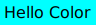
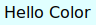

# qute!

> *designify your terminal with a large ansi colors palette*

[Examples](#examples) &mdash; [API](#api) &mdash; [Goals](#goals) &mdash; [License](#license)

a nice ANSI escape codes `API` to use ansi color in a elegant way that support *8 color, 16 color, 88 color, 256 color and 16 millions color mode.* You can manage the color mode by yourself, you got the control dude!

## <a name="examples"></a> Examples

```rust
extern crate qute;


use qute::*;
use qute::design::Designer;


fn main () {
  println!("{}", qute!(" BLACK WHITE (BASIC) ").background_black().white());
}
```

## <a name="api"></a> API

the `qute!` macro contains all method to designify your terminal as you want. `Select Graphic Rendition` are parameters applied into the escape sequence format string. See the `SGR` table below   

### Modifier

**no params**

**returns**

`self` **{ Designer }**: the current instance

| color         | snippet                                  | preview                                                          |
|---------------|------------------------------------------|------------------------------------------------------------------|
| bold          | ```qute!("my string").bold()```          |            |
| dim           | ```qute!("my string").dim()```           |             |
| underlined    | ```qute!("my string").underline()```     |       |
| blink         | ```qute!("my string").blink()```         |           |
| reverse       | ```qute!("my string").reverse()```       |         |
| hidden        | ```qute!("my string").hidden()```        |          |
| strikethrough | ```qute!("my string").strikethrough()``` |   |

### Foreground

**no params**

**returns**

`self` **{ Designer }**: the current instance

| color         | snippet                                  | preview                                                            |
|---------------|------------------------------------------|--------------------------------------------------------------------|
| black         | ```qute!("my string").black()```         |           |
| red           | ```qute!("my string").red()```           |             |
| green         | ```qute!("my string").green()```         |           |
| yellow        | ```qute!("my string").yellow()```        |          |
| blue          | ```qute!("my string").blue()```          |            |
| magenta       | ```qute!("my string").magenta()```       |         |
| cyan          | ```qute!("my string").cyan()```          |            |
| gray          | ```qute!("my string").gray()```          |            |
| light_red     | ```qute!("my string").light_red()```     |       |
| light_green   | ```qute!("my string").light_green()```   |     |
| light_yellow  | ```qute!("my string").light_yellow()```  |    |
| light_blue    | ```qute!("my string").light_blue()```    |      |
| light_magenta | ```qute!("my string").light_magenta()``` |   |
| light_cyan    | ```qute!("my string").light_cyan()```    |      |
| white         | ```qute!("my string").white()```         |           |

### Background

**no params**

**returns**

`self` **{ Designer }**: the current instance

| color         | snippet                                             | preview                                                           |
|---------------|-----------------------------------------------------|-------------------------------------------------------------------|
| black         | ```qute!("my string").background_black()```         |          |
| red           | ```qute!("my string").background_red()```           |            |
| green         | ```qute!("my string").background_green()```         |          |
| yellow        | ```qute!("my string").background_yellow()```        |         |
| blue          | ```qute!("my string").background_blue()```          |           |
| magenta       | ```qute!("my string").background_magenta()```       |        |
| cyan          | ```qute!("my string").background_cyan()```          |           |
| gray          | ```qute!("my string").background_gray()```          |           |
| light_red     | ```qute!("my string").background_light_red()```     |      |
| light_green   | ```qute!("my string").background_light_green()```   |    |
| light_yellow  | ```qute!("my string").background_light_yellow()```  |   |
| light_blue    | ```qute!("my string").background_light_blue()```    |     |
| light_magenta | ```qute!("my string").background_light_magenta()``` |  |
| light_cyan    | ```qute!("my string").background_light_cyan()```    |     |
| white         | ```qute!("my string").background_white()```         |          |

### <a name="256-colors"></a> 256 Colors

**params**

`n` **{ u8 }**: the color number - *from 0 to 255*

**returns**

`self` **{ Designer }**: the current instance

| mode       | snippet                                          | preview                                                 |
|------------|--------------------------------------------------|---------------------------------------------------------|
| foreground | ```qute!("my string").set_rgb_color(231)```      |       |
| background | ```qute!("my string").set_rgb_background(220)``` |  |

### <a name="rgb"></a> RGB

**params**

`r` **{ u8 }**: the standard red
`g` **{ u8 }**: the standard green
`b` **{ u8 }**: the standard blue

**returns**

`self` **{ Designer }**: the current instance

| mode       | snippet                                                    | preview                                                 |
|------------|------------------------------------------------------------|---------------------------------------------------------|
| foreground | ```qute!("my string").set_rgb_color(255, 255, 255)```      |       |
| background | ```qute!("my string").set_rgb_background(128, 128, 128)``` |  |

### CSS

CSS colors keyword are supported. See the complete list [here](https://www.w3.org/TR/2018/REC-css-color-3-20180619/#svg-color)

**params**

`keyword` **{ String }**: the css color keyword

**returns**

`self` **{ Designer }**: the current instance

| mode       | snippet                                                  | preview                                                 |
|------------|----------------------------------------------------------|---------------------------------------------------------|
| foreground | ```qute!("my string").set_css_color("lime")```           |       |
| background | ```qute!("my string").set_css_background("aquamarine")``` |  |

## <a name="goals"></a> Goals

* [x] support modifiers
* [x] support vga
* [x] support rgb
* [x] support css colors keywords
* [ ] support hexa
* [ ] support hsl
* [ ] support format string
* [ ] detect color terminal support
* [ ] hsl to rgb
* [ ] unit testing
* [ ] convert to css
* [ ] cross platform
* [ ] documentation
* [ ] port js (?)

## <a name="license"></a> License   

Copyright ©️ 2020 Qurity    

Released under the [MIT](LICENSE) license    
